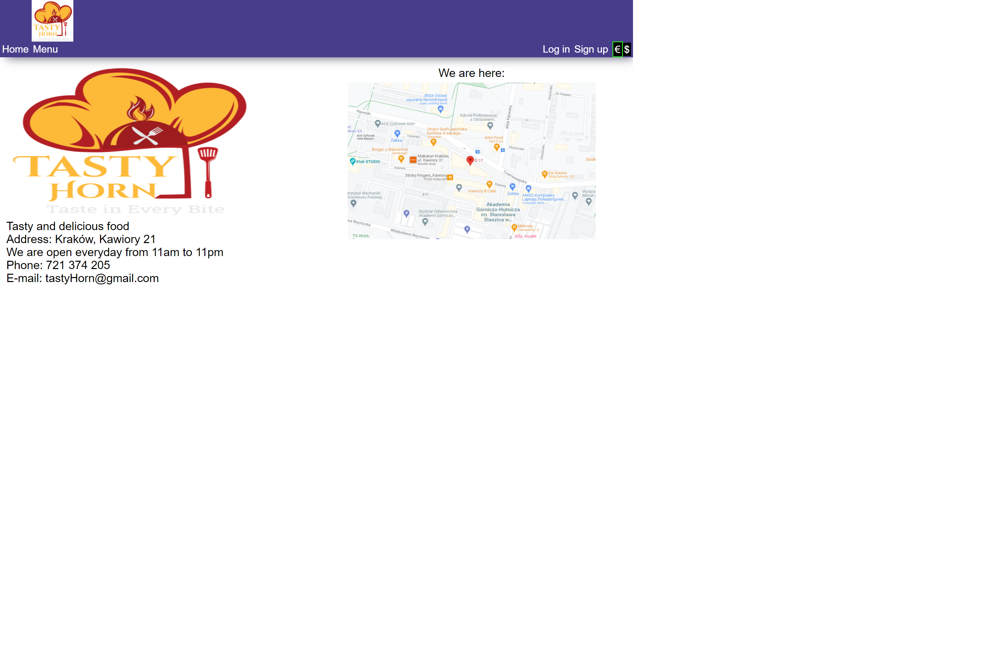
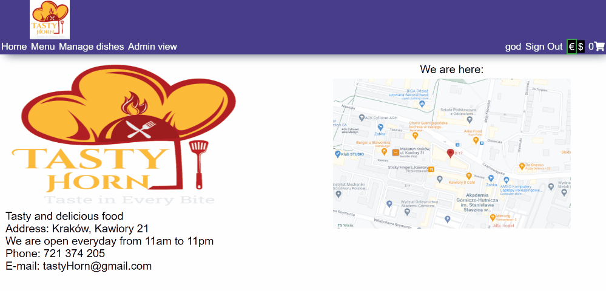

# Tasty Horn

## Brief
Project created during Introduction to Web Application course - main theme of this project is to create a single-page web application for restaurant. The app lets users create their accounts, browse and order dishes, rate them and leave reviews. It has as well different functionalities for manager, who can add, edit and remove dishes and for admin, who have permissions to change persistence and manage users.

## Functionalities 
1. #### Main page
  On the main page you can find very brief description of the restaurant.
  
 

2. #### Creating an account
  To see dish details, you need to be logged in to your account, which you can as well create.

3. #### Ordering, rating and reviewing dishes
  Menu has implemented filters that help you select desirable dish as well as pagination that declutters your screen.

4. #### Editing menu
  As a manager you have access to the dish list and you can freely modify them
 
 

 
5. #### Admin privileges
  As an adimn you can set the persistence and manage users
   
 

Application has implemented guards that secure access to parts, which require additional permissions.
Project was made with the usage of Angular for the frontend part, backend was implemented with the help of Firebase.

Feel free to try this app by yourself: https://tasty-horn.web.app/

# Restaurant

This project was generated with [Angular CLI](https://github.com/angular/angular-cli) version 13.0.4.

## Development server

Run `ng serve` for a dev server. Navigate to `http://localhost:4200/`. The app will automatically reload if you change any of the source files.

## Code scaffolding

Run `ng generate component component-name` to generate a new component. You can also use `ng generate directive|pipe|service|class|guard|interface|enum|module`.

## Build

Run `ng build` to build the project. The build artifacts will be stored in the `dist/` directory.

## Running unit tests

Run `ng test` to execute the unit tests via [Karma](https://karma-runner.github.io).

## Running end-to-end tests

Run `ng e2e` to execute the end-to-end tests via a platform of your choice. To use this command, you need to first add a package that implements end-to-end testing capabilities.

## Further help

To get more help on the Angular CLI use `ng help` or go check out the [Angular CLI Overview and Command Reference](https://angular.io/cli) page.
